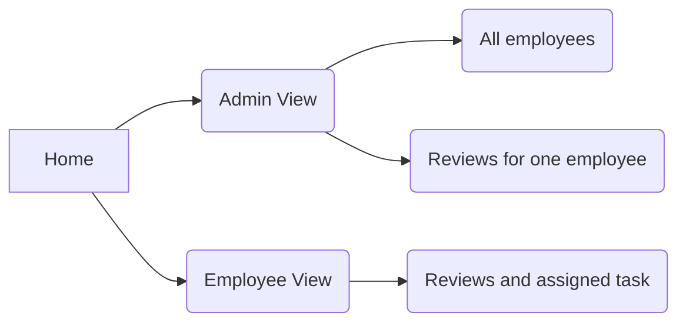

# PayReview

This is a sample web app for employees reviews

## App Structure

## Design Ideas
###  Simple CMS
The requirement app is considered as a simple CMS which focused on employees infomation and reviews. Therefore, in case of MySQL basic data operation such as **select**, **insert**, **update**, **delete** should be implemented. There should be two tables one for employees, the other for reviews. To deploy and test easily, CSV file was used to save data in this demo. Top admin view was using data api, other pages are using static respones.
### User Roles
There are two roles required, administrator and normal employee with different permissions. Administrator can access all data tables but employees can only access data items related to themselves. User authentication process was skipped in this demo.
### Interfaces
To provide clear and convinient interactions, data was shown in table and list format, with operation buttons nearby its data element. Operations were completed with less page redirect and refresh.

## Main Technologies
- Server Side
	- Node.js (Express) - for handle api request
	- Database - CSV file was used to make it easy to deploy
- Front End
	- React Framwork
	- Bootstrap

## Deploy and Test

This demo app was able to be deploied and tested using commands  below

```
$ npm install
$ npm start
```

Then visit [http://localhost:3000](http://localhost:3000/) to see the result
